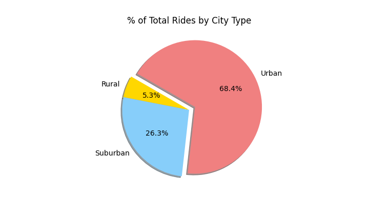

# PyBer_Analysis

## Purpose of the analysis
The purpose of the analysis is to create visualizations of rideshare data for PyBer to help improve access to ride-sharing services and determine affordability for underserved neighborhoods. Looking at rows and columns is not the best way to outline trends and pinpoint growth opportunities. In this analysis, visualizations play a big role because through data visualization the audience absorbs information quickly and facilitates pattern detection.

## Results

Ride data by city type shows that there is a big difference between city types. Total Rides in Urban cities by themselves make up about 68.4 percent of all rides. Urban cities have 1627 rides, while Suburban cities have 625 Total Rides and Rural cities have 125 rides. This can be seen in the pie cart below.

#### % Total Rides by City Type

Also, Total Fares from Urban cities are almost twice as much as Total Fares of Rural and Suburban cities if they were combined. Urban cities have a Total Fare of $39,854.38, while Suburban cities have a Total Fare of $19,356.33 and Rural cities have a Total Fare of $4,327.93. Urban cities have more riders and drivers, but Urban cities have lower fares and pay their drivers much less. For example, the Average Fare per Ride in an Urban city is $24.53, while Suburban cities have an Average Fare per Ride of $30.97 and Rural cities have an Average Fare per Ride of $34.62. Also, Urban cities have an Average fare per Driver of $16.57, while Suburban cities have an Average Fare per Driver of $39.50 and Rural cities have an Average Fare per Driver of $55.49. This can be seen in the table below.

#### Ride-Sharing Summary By City Type

In the Total Fare by City Type graph, it can be seen that Urban cities generate more money through out the year compared to Suburban cities and Rural cities. Also, the lines for city types depicting revenue through January 2019 - April 2019 never intersect with each other. This means that if PyBer wants to introduce a new Urban city it is very likely the new Urban city will generate similar Fare to other Urban cities because Urban Fares are consistent and high. Finally, there is a peak in Fare at the end of February and the beginning of March for all three city types.

#### PyBer Fare Summary

## Summary
